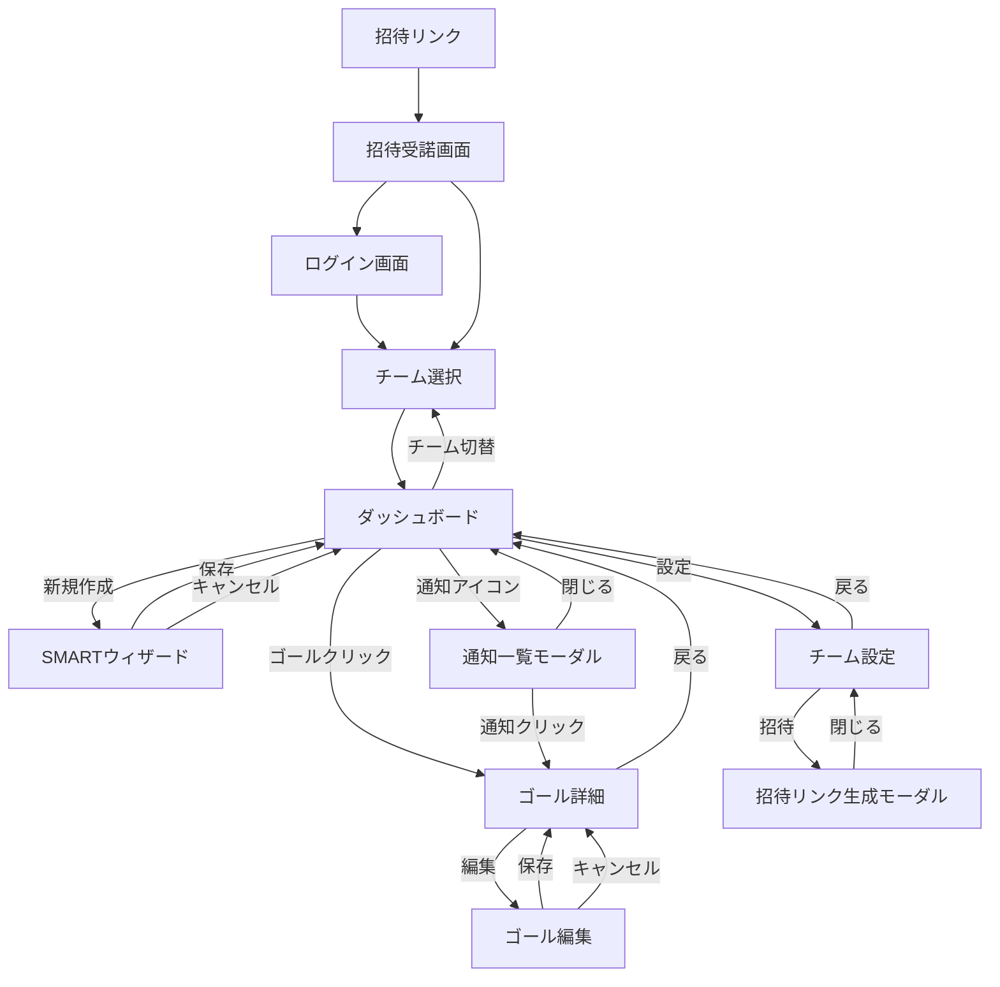

# 02_画面遷移図・画面一覧

## 1. 画面一覧

1. **ログイン / サインアップ**: 認証画面
2. **招待受諾画面**: 招待リンクからのランディング
3. **チーム選択**: 所属チームの選択
4. **チームダッシュボード**: ゴール一覧、サマリー表示
5. **SMARTゴール作成ウィザード**: ゴール作成フォーム
6. **ゴール詳細**: 詳細情報、投票、アプローチ管理
7. **ゴール編集画面**: 既存ゴールの編集
8. **通知一覧モーダル**: 通知の確認
9. **チーム設定画面**: チーム情報、メンバー管理
10. **招待リンク生成モーダル**: 招待URLの発行

## 2. 画面遷移図 (Mermaid)

