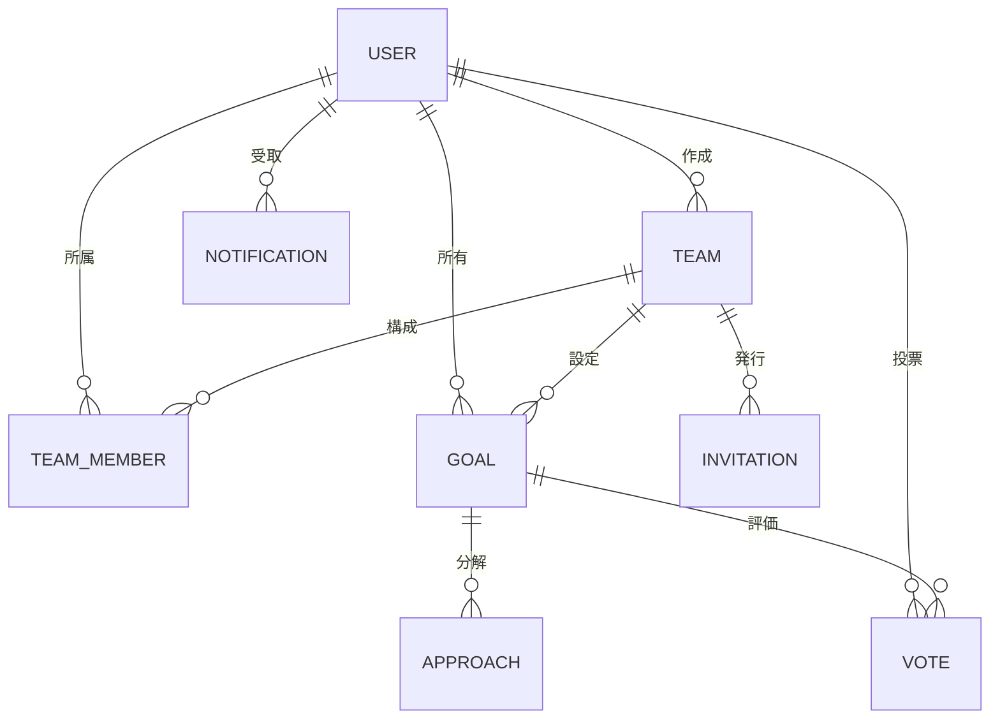

# データモデル（ER図案・詳細）

## 1. エンティティ一覧

### User (ユーザー)

- **ユーザーID** (PK): UUID
- **名前**: String(50), 必須
- **メールアドレス**: String(255), 必須, Unique
- **パスワードハッシュ**: String, 必須
- **アイコンURL**: String, 任意

### Team (チーム)

- **チームID** (PK): UUID
- **チーム名**: String(50), 必須
- **説明**: String(200), 任意
- **作成者ID** (FK -> User): UUID, 必須

### TeamMember (チームメンバー)

- **ID** (PK): UUID
- **チームID** (FK -> Team): UUID, 必須
- **ユーザーID** (FK -> User): UUID, 必須
- **ロール**: Enum(Leader, Member), 必須, Default: Member

### Goal (SMARTゴール)

- **ゴールID** (PK): UUID
- **チームID** (FK -> Team): UUID, 必須
- **タイトル**: String(100), 必須
- **具体的 (Specific)**: Text(10-500), 必須
- **測定可能 (Measurable)**: Text(200), 必須
- **達成可能 (Achievable)**: Boolean, 必須
- **関連性 (Relevant)**: Text(200), 必須
- **期限 (Time-bound)**: Date, 必須 (未来日)
- **所有者ID** (FK -> User): UUID, 必須
- **ステータス**: Enum(TODO, IN_PROGRESS, DONE), 必須, Default: TODO
- **作成日時**: Timestamp
- **更新日時**: Timestamp

### Approach (アプローチ/手順)

- **アプローチID** (PK): UUID
- **ゴールID** (FK -> Goal): UUID, 必須
- **内容**: String(100), 必須
- **完了フラグ**: Boolean, Default: false
- **順序**: Integer, 必須

### Vote (投票)

- **投票ID** (PK): UUID
- **ゴールID** (FK -> Goal): UUID, 必須
- **ユーザーID** (FK -> User): UUID, 必須
- **投票日時**: Timestamp
- *Unique Constraint: (ゴールID, ユーザーID)*

### Notification (通知)

- **通知ID** (PK): UUID
- **ユーザーID** (FK -> User): UUID, 必須
- **種別**: Enum(GOAL_CREATED, STATUS_CHANGED, DEADLINE_REMINDER, GOAL_COMPLETED)
- **メッセージ**: String(500), 必須
- **関連ゴールID** (FK -> Goal): UUID, 任意
- **既読フラグ**: Boolean, Default: false
- **作成日時**: Timestamp

### Invitation (招待)

- **招待ID** (PK): UUID
- **トークン**: String, Unique, 必須
- **チームID** (FK -> Team): UUID, 必須
- **招待者ID** (FK -> User): UUID, 必須
- **有効期限**: Timestamp, 必須 (作成+7日)
- **使用済みフラグ**: Boolean, Default: false
