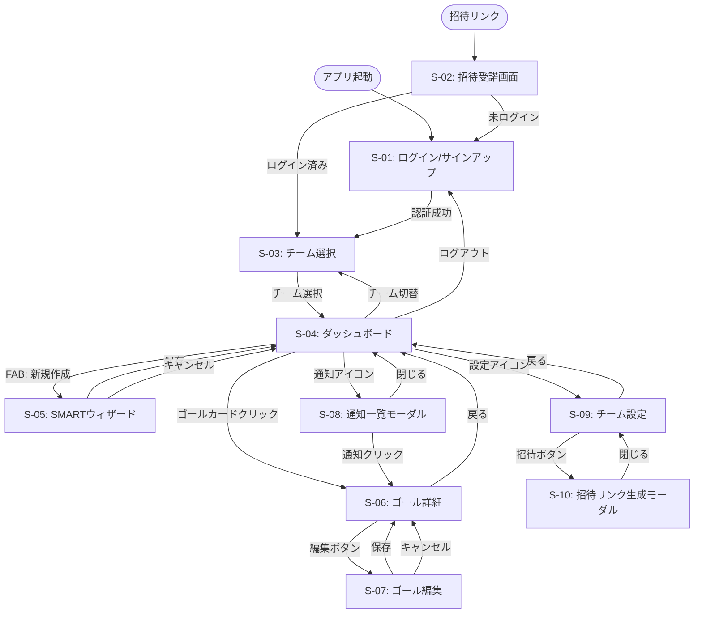

# 基本設計：画面遷移図

要件定義の「画面遷移図・画面一覧」および「機能一覧表」をもとに、基本設計レベルで詳細化した画面遷移図です。

## 1. 画面一覧（基本設計版）

| 画面ID | 画面名 | 機能概要 | 関連機能ID |
|--------|--------|----------|------------|
| **S-01** | ログイン / サインアップ | メール/パスワード、Googleログイン | F-001 |
| **S-02** | 招待受諾画面 | 招待リンク経由のチーム参加。**表示**: チーム名・招待者情報。参加ボタンで加入。 | F-003 |
| **S-03** | チーム選択 | 複数チーム所属時の切替 | F-004 |
| **S-04** | チームダッシュボード | ゴール一覧、サマリー、FAB | F-006, F-011, F-012 |
| **S-05** | SMARTゴール作成ウィザード | 6ステップのゴール入力フォーム | F-005 |
| **S-06** | ゴール詳細 | 詳細表示、投票、アプローチチェックリスト、ステータス変更、編集/削除（権限時）、**完了時フィードバック入力** | F-007, F-010, F-011 |
| **S-07** | ゴール編集画面 | 既存ゴールの編集 | F-008 |
| **S-08** | 通知一覧モーダル | 通知の確認・既読管理 | F-013, F-014 |
| **S-09** | チーム設定画面 | チーム情報編集、メンバー管理（**リーダーのみ**） | F-002, F-003, F-015 |
| **S-10** | 招待リンク生成モーダル | 招待URL発行・コピー（**リーダーのみ**） | F-003 |

---

## 2. 画面遷移図（基本設計版・Mermaid）

---

## 3. 遷移の詳細説明

### 3.1 認証・招待フロー

- **アプリ起動** → ログイン画面（未認証の場合）
- **招待リンク** → 招待受諾画面 → 未ログインならサインアップ画面へ遷移／ログイン済みなら**確認ダイアログ**表示後、チームに参加
- **ログイン成功** → **チーム選択**（複数チーム所属時）／**ダッシュボード**（所属チームが1つの場合はチーム選択をスキップ）。リーダーは管理する2チームから選択。

### 3.2 ダッシュボード中心の操作

- **ゴール作成**: FAB → ウィザード（6ステップ） → 保存 → ダッシュボード
- **ゴール閲覧・編集**: ゴールカード → 詳細 → 編集 → 保存 → 詳細 → ダッシュボード
- **投票**: ダッシュボードまたはゴール詳細で投票ボタン（画面遷移なし、その場で更新）

### 3.3 通知・設定

- **通知**: ヘッダーの通知アイコン → モーダル表示 → 通知クリックでゴール詳細へ
- **チーム設定**: ダッシュボード → 設定 → チーム情報編集・招待リンク生成
- **チーム切替**: ダッシュボード → チーム選択 → 別チームのダッシュボード

---

## 4. 補足事項（条件分岐・モーダル・ウィザード・共通導線）

### 4.1 条件分岐のルール（権限・状態による制御）

| 条件 | 遷移・表示 |
|------|------------|
| **未ログイン**で招待リンクを開いた場合 | 招待受諾画面 → サインアップ／ログイン画面へ遷移。認証成功後、当該チームに参加しチーム選択（または1チームならダッシュボード）へ。 |
| **ログイン済み**で招待リンクを開いた場合 | 招待受諾画面で確認ダイアログ表示 → 参加でチームに加入 → チーム選択（または1チームならダッシュボード）へ。 |
| **所属チームが1つ**の場合 | ログイン／招待参加後、チーム選択画面はスキップしダッシュボードへ。 |
| **メンバー**がチーム設定（S-09）のURLを直接開いた場合 | 権限なしのためアクセス不可（403またはダッシュボードへリダイレクト）。チーム設定・招待リンクの入口はリーダーのみ表示。 |
| **メンバー**が他人が作成したゴールの編集（S-07）に直接遷移した場合 | 権限なしのためアクセス不可（403またはゴール詳細へリダイレクト）。編集・削除ボタンは権限がある場合のみ表示。 |

### 4.2 モーダル・ポップアップの扱い

| 対象 | 扱い | 備考 |
|------|------|------|
| **通知一覧（S-08）** | 画面内の一部（モーダル）。画面遷移しない。閉じるでダッシュボードに留まる。 | ヘッダー通知アイコンで表示。 |
| **招待リンク生成（S-10）** | 画面内の一部（モーダル）。画面遷移しない。閉じるでチーム設定に留まる。 | チーム設定画面から「招待」で表示。 |
| **招待受諾時の確認**（ログイン済み） | ダイアログ。画面遷移せず、確定後にチーム参加処理し遷移。 | — |
| **削除確認**（ゴール削除など） | 画面遷移せず削除確認モーダルを表示。実行後はゴール詳細→一覧（ダッシュボード）を更新。 | 実装でモーダルとする。 |
| **ウィザードのキャンセル** | 確認ダイアログ表示後、入力破棄してダッシュボードへ戻る。 | 要件定義 7.3 に準拠。 |

### 4.3 前後関係の強制（ウィザード形式）

- **SMARTゴール作成ウィザード（S-05）は、6ステップ（具体的→測定可能→達成可能→関連性→期限→アプローチ）を順に**進める。
- **戻る**で前ステップへは遷移可能。**次へ**はバリデーション通過時のみ有効。
- **URLやブックマークで**途中ステップや「確認」「完了」に直接アクセスすることは**禁止**。未認証・未入力の場合は最初のステップへリダイレクトする。

### 4.4 共通パーツからの遷移

| 共通パーツ | 遷移・動作 |
|------------|------------|
| **ヘッダー：通知アイコン** | 通知一覧モーダルを表示（全画面で同一。ダッシュボード以外でも表示する場合は同様にモーダル）。 |
| **ヘッダー：チーム切替** | チーム選択画面へ遷移。 |
| **ヘッダー：ユーザーアイコン／ログアウト** | ログアウト実行後、ログイン画面へ遷移。確認ダイアログの要否は実装で定義。 |
| **チーム設定・招待リンク** | リーダーのみ表示。メンバーには非表示。 |

---

## 5. 要件定義版との違い（基本設計での詳細化）

| 項目 | 要件定義版 | 基本設計版 |
|------|------------|------------|
| **画面ID** | なし | S-01 〜 S-10 で管理 |
| **機能IDとの紐付け** | なし | 各画面に関連機能ID（F-001など）を明記 |
| **遷移の起点** | ログイン画面 | アプリ起動・招待リンクの2つの起点を明示 |
| **ログアウト** | 記載なし | ダッシュボード → ログインの戻り遷移を追加 |
| **補足事項** | 記載なし | 4. に条件分岐・モーダル・ウィザード・共通導線を追記 |

---

## 6. 参照

- Notion「要件定義」> [画面遷移図・画面一覧](https://www.notion.so/30740870129781aba82dfae4fbbc4cf3)
- Notion「要件定義」> [機能一覧表](https://www.notion.so/307408701297819abd4fc7a91ce356ec)
- [システム要件定義書（GitHub）](https://github.com/Saitekiinc-com/SMART-App/blob/main/docs/requirements/system_requirements.md) 第3章
