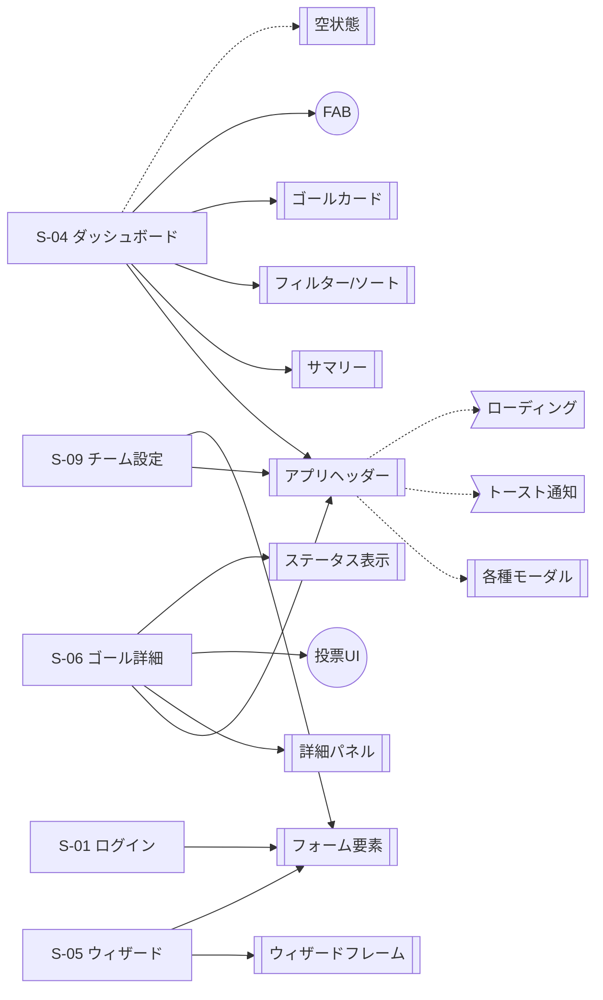

# 基本設計：共通UIコンポーネント定義

---

## 1. 参照ドキュメント

| ドキュメント | URL |
|--------------|-----|
| 画面遷移図（基本設計） | [01_画面遷移図、画面一覧](https://www.notion.so/30c40870129781148fc1fce863b5098f) |
| 機能一覧表 | [機能一覧表](https://www.notion.so/307408701297819abd4fc7a91ce356ec) |
| 非機能要件定義書 | [非機能要件定義書](https://www.notion.so/307408701297812da14cfa7b69a138a0) |

---

## 2. 非機能要件によるUI制約（共通）

非機能要件より、全コンポーネントで考慮する点。

- **性能**: 画面表示は3秒以内。一覧は50件まで遅延なし。ローディング表示・スケルトン等で体感を考慮する。
- **技術スタック**: React (Next.js) + TypeScript。コンポーネントはこの前提で設計する。
- **認証・認可**: 権限に応じた表示・非表示（リーダー／メンバー）。権限のない操作はボタン非表示または無効化。

---

## 3. 共通UIコンポーネント一覧

### 3.1 アプリヘッダー（AppHeader）

| 項目 | 内容 |
|------|------|
| **役割** | 認証後の全画面で共通のナビゲーション・アクション領域。 |
| **構成要素** | チーム名、通知アイコン、ユーザーアイコン（またはメニュー）、チーム切替。リーダーのみ「設定」を表示。 |
| **表示制御** | チーム設定・招待リンクの入口はリーダーのみ。メンバーには非表示。 |
| **主な動作** | 通知アイコン→通知一覧モーダル、チーム切替→チーム選択画面、ユーザー／ログアウト→ログイン画面。 |
| **使用画面** | S-04 ダッシュボード、S-06 ゴール詳細、S-07 ゴール編集、S-09 チーム設定 等（認証後メイン領域を持つ画面）。 |

**補足**: 画面遷移図 4.4 共通パーツからの遷移に準拠。

---

### 3.2 ゴールカード（GoalCard）

| 項目 | 内容 |
|------|------|
| **役割** | ダッシュボードのゴール一覧で1ゴールを表すカード。クリックでゴール詳細へ。 |
| **構成要素** | タイトル、ステータス（未着手／進行中／完了）の色分け、投票数バッジ、アプローチ進捗（任意）、「進行中」の強調表示。 |
| **主な動作** | カードクリック→S-06 ゴール詳細へ遷移。投票はダッシュボード上または詳細で実施（機能一覧 F-011, F-012）。 |
| **使用画面** | S-04 チームダッシュボード。 |
| **非機能** | 一覧は50件まで。スクロール・仮想スクロール等で遅延しないこと。 |

---

### 3.3 FAB（Floating Action Button）

| 項目 | 内容 |
|------|------|
| **役割** | 新規SMARTゴール作成の起点。 |
| **主な動作** | タップ→S-05 SMARTゴール作成ウィザードへ遷移。 |
| **使用画面** | S-04 チームダッシュボード。 |

---

### 3.4 サマリーセクション（DashboardSummary）

| 項目 | 内容 |
|------|------|
| **役割** | ダッシュボード上部のチーム状況サマリー。 |
| **構成要素** | 進行中ゴール数、達成率（または完了数）等の数値・短いテキスト。 |
| **使用画面** | S-04 チームダッシュボード。 |

---

### 3.5 通知一覧モーダル（NotificationListModal）

| 項目 | 内容 |
|------|------|
| **役割** | アプリ内通知の一覧表示。画面遷移せずオーバーレイで表示。 |
| **構成要素** | 通知リスト、各通知の未読／既読状態、閉じるボタン。 |
| **主な動作** | 通知クリック→関連画面（主にゴール詳細）へ遷移しモーダル閉じる。閉じる→呼び出し元画面に留まる。 |
| **使用画面** | S-08。ヘッダー通知アイコンから表示（S-04 等）。 |
| **関連機能** | F-013 アプリ内通知、F-014 未読管理。 |

---

### 3.6 招待リンク生成モーダル（InviteLinkModal）

| 項目 | 内容 |
|------|------|
| **役割** | 招待リンクの表示・コピー。画面遷移せずモーダルで完結。 |
| **構成要素** | 招待URL表示、コピーボタン、有効期限の表示。 |
| **表示制御** | リーダーのみ。メンバーには表示しない。 |
| **主な動作** | コピーでクリップボードにURLをコピー。閉じる→S-09 チーム設定に留まる。 |
| **使用画面** | S-10。S-09 チーム設定から「招待」で表示。 |
| **関連機能** | F-003 メンバー招待。 |

---

### 3.7 確認ダイアログ（ConfirmDialog）

| 項目 | 内容 |
|------|------|
| **役割** | 実行前の確認。画面遷移せずダイアログで表示。 |
| **利用シーン** | 招待参加の確認（ログイン済み時）、ゴール削除の確認、ウィザードキャンセル時の入力破棄確認。 |
| **構成要素** | メッセージ、確定ボタン、キャンセルボタン。 |
| **バリエーション** | 危険操作（削除）はスタイルで区別することを推奨。 |

---

### 3.8 ウィザードフレーム（WizardFrame）

| 項目 | 内容 |
|------|------|
| **役割** | 複数ステップを順に進める入力フロー用の共通フレーム。 |
| **構成要素** | ステップインジケーター（1/6 等）、現在ステップのコンテンツ領域、「戻る」「次へ」「キャンセル」ボタン。最終ステップで「確認」「保存」等。 |
| **ルール** | 次へはバリデーション通過時のみ有効。戻るは常に可。キャンセルは確認ダイアログ後、入力破棄してダッシュボードへ。URLで途中・完了へ直アクセスは禁止（最初のステップへリダイレクト）。 |
| **使用画面** | S-05 SMARTゴール作成ウィザード、S-07 ゴール編集（同様のステップUI）。 |
| **関連機能** | F-005 SMARTゴール作成ウィザード。 |

---

### 3.9 ゴール詳細パネル（GoalDetailPanel）

| 項目 | 内容 |
|------|------|
| **役割** | S-06 ゴール詳細画面のメインコンテンツ。ゴール情報・投票・アプローチ・アクションを表示。 |
| **構成要素** | タイトル、SMART要素の表示、投票セクション（投票ボタン・投票数）、アプローチチェックリスト（進捗%・ハイライト）、ステータス変更UI、編集／削除ボタン（権限時）、完了時フィードバック入力。 |
| **表示制御** | 編集・削除は作成者またはリーダーのみ表示（F-008, 権限マトリクス）。 |
| **使用画面** | S-06 ゴール詳細。 |

---

### 3.10 フォーム要素（FormElements）

| 項目 | 内容 |
|------|------|
| **役割** | ログイン、サインアップ、ウィザード、チーム設定等で共通利用する入力部品。 |
| **種類** | テキスト入力（単行・複数行）、日付選択、チェックボックス、リスト（アプローチの追加・削除・並び替え）、ボタン（プライマリ・セカンダリ・危険）。 |
| **バリデーション** | エラーはフィールド直下に表示。エラー時はフィールドを赤枠等でハイライト。非機能要件のレスポンス時間内にフィードバックを返す。 |

---

### 3.11 ステータス表示（StatusBadge / StatusDisplay）

| 項目 | 内容 |
|------|------|
| **役割** | ゴールの状態（未着手／進行中／完了）を色・ラベルで表示。 |
| **使用箇所** | ゴールカード、ゴール詳細、一覧のソート・フィルタ。 |
| **関連** | F-009 ステータス変更。 |

---

### 3.12 投票UI（VoteUI）

| 項目 | 内容 |
|------|------|
| **役割** | 1ゴールにつき1票の投票と、投票数の表示。 |
| **構成要素** | 投票ボタン（またはトグル）、投票数バッジ／ラベル。 |
| **ルール** | 未着手ゴールのみ投票可能。取り消し・変更可。自作ゴールにも投票可（機能一覧）。 |
| **使用画面** | S-04 ダッシュボード（カード上のバッジ）、S-06 ゴール詳細（投票セクション）。 |
| **関連機能** | F-011 優先順位投票、F-012 投票結果表示。 |

---

### 3.13 チーム選択リスト（TeamSelectList）

| 項目 | 内容 |
|------|------|
| **役割** | 所属チームの一覧から1つを選び、そのチームのダッシュボードへ遷移する。 |
| **表示制御** | 所属チームが1つの場合はこの画面をスキップ（遷移図 4.1）。リーダーは管理する2チームから選択。 |
| **使用画面** | S-03 チーム選択。 |

---

### 3.14 認証フォーム（AuthForm）

| 項目 | 内容 |
|------|------|
| **役割** | ログイン・サインアップ用のフォーム。 |
| **構成要素** | メール、パスワード、Googleログインボタン等。エラー表示領域。 |
| **使用画面** | S-01 ログイン／サインアップ。 |
| **関連機能** | F-001 ユーザー登録・ログイン。非機能：パスワードはハッシュ化、認証トークンに有効期限。 |

---

### 3.15 招待受諾カード（InviteAcceptCard）

| 項目 | 内容 |
|------|------|
| **役割** | 招待リンク経由で表示。チーム名・招待者情報を表示し、参加可否を選択。 |
| **構成要素** | チーム名、招待者情報、参加ボタン。未ログイン時はサインアップ／ログインへ誘導。 |
| **使用画面** | S-02 招待受諾画面。 |
| **関連機能** | F-003 メンバー招待。 |

---

### 3.16 チーム設定フォーム・メンバーリスト（TeamSettingsContent）

| 項目 | 内容 |
|------|------|
| **役割** | チーム情報の編集、メンバー一覧と削除、招待リンク生成ボタン。 |
| **表示制御** | リーダーのみ。メンバーはアクセス不可（403またはリダイレクト）。 |
| **使用画面** | S-09 チーム設定画面。 |
| **関連機能** | F-002 チーム作成、F-003 メンバー招待、F-015 ロール管理。 |

---

### 3.17 トースト通知（ToastNotification）

| 項目 | 内容 |
|------|------|
| **役割** | 処理の成功・失敗をユーザーに一時的に通知する。画面上部または下部にオーバーレイ表示。 |
| **利用シーン** | ゴール作成・編集完了時、設定保存時、エラー発生時。 |
| **構成要素** | アイコン（成功/失敗/情報）、メッセージ、閉じるボタン（任意）。数秒で自動消去。 |

---

### 3.18 ローディング・スケルトン（LoadingState）

| 項目 | 内容 |
|------|------|
| **役割** | データ取得中であることを示し、体感待ち時間を軽減する。 |
| **種類** | スピナー（全画面またはボタン内）、スケルトンスクリーン（カードやリストの枠のみ表示）。 |
| **非機能** | 画面表示3秒以内の目標に対し、即座にローディングを返すことで応答性を確保する。 |

---

### 3.19 空状態表示（EmptyState）

| 項目 | 内容 |
|------|------|
| **役割** | データが存在しない場合の表示。 |
| **利用シーン** | ダッシュボード（ゴールが0件）、通知一覧（通知なし）、検索結果0件。 |
| **構成要素** | イラストまたはアイコン、説明テキスト、アクションボタン（例：「ゴールを作成する」）。 |

---

### 3.20 フィルター・ソートUI（FilterSortUI）

| 項目 | 内容 |
|------|------|
| **役割** | 一覧データの絞り込み・並び替え。 |
| **構成要素** | ドロップダウンメニュー、タブ切り替え、トグルボタン。 |
| **利用シーン** | ダッシュボード（ステータス別、投票数順）、メンバー一覧。 |

---

## 4. コンポーネントと画面の対応表

| 画面ID | 画面名 | 主に使用する共通コンポーネント |
|--------|--------|--------------------------------|
| S-01 | ログイン／サインアップ | 認証フォーム、フォーム要素 |
| S-02 | 招待受諾画面 | 招待受諾カード、確認ダイアログ（ログイン済み時） |
| S-03 | チーム選択 | チーム選択リスト |
| S-04 | チームダッシュボード | アプリヘッダー、サマリーセクション、ゴールカード、FAB |
| S-05 | SMARTゴール作成ウィザード | ウィザードフレーム、フォーム要素、確認ダイアログ |
| S-06 | ゴール詳細 | アプリヘッダー、ゴール詳細パネル、投票UI、ステータス表示、確認ダイアログ（削除） |
| S-07 | ゴール編集 | アプリヘッダー、ウィザードフレーム、フォーム要素、確認ダイアログ |
| S-08 | 通知一覧モーダル | 通知一覧モーダル（オーバーレイ） |
| S-09 | チーム設定 | アプリヘッダー、チーム設定フォーム・メンバーリスト |
| S-10 | 招待リンク生成モーダル | 招待リンク生成モーダル（オーバーレイ） |

---

## 5. コンポーネント構成図（Mermaid）

各画面で主に使用する共通コンポーネントの関連図です。

---

## 6. 改訂履歴・備考

- 初版：画面遷移図・機能一覧表・非機能要件定義書に基づき作成。
- ワイヤーフレーム作成後、レイアウトやバリエーションに応じて本定義を更新する。
