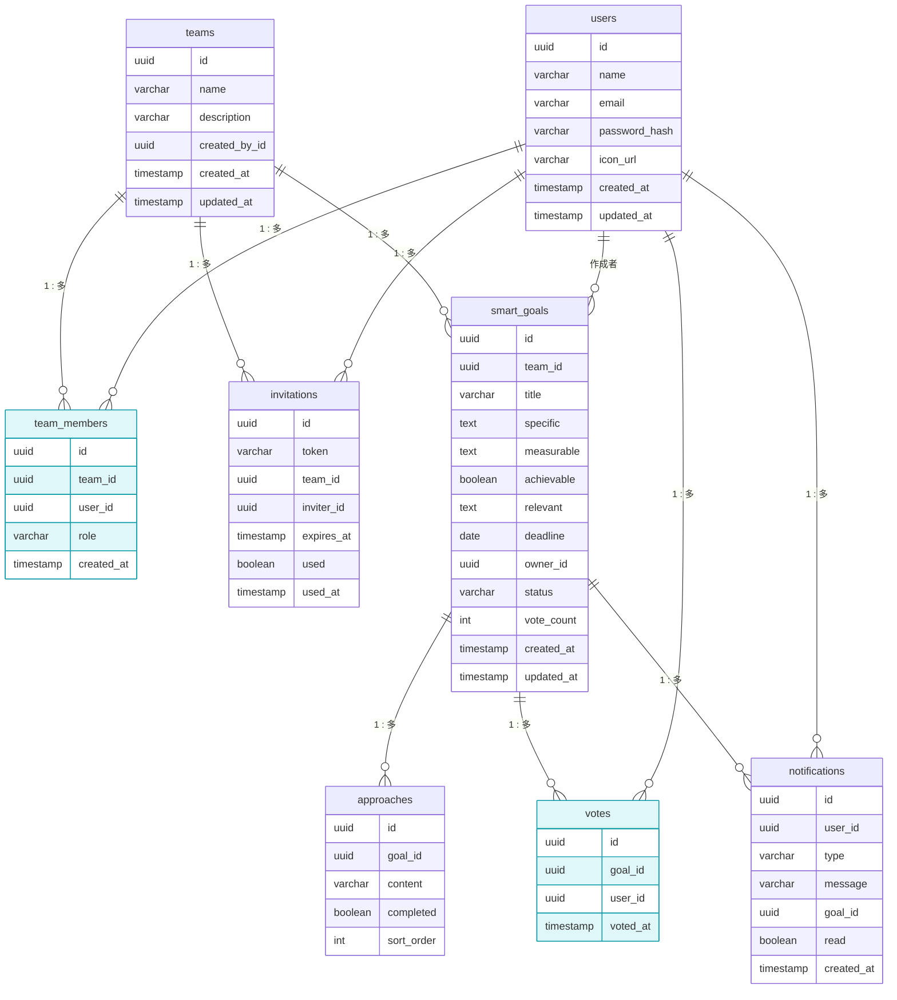

# 基本設計 ER図

## 設計方針・ルールまとめ

### 目指すレベル

データベースのテーブル作成（CREATE TABLE）が迷いなく書けるレベルを目指す。

### テーブル定義で押さえる項目

| 項目 | 内容 |
|------|------|
| 論理名・物理名 | 「目標名」だけでなく `title` のようにコードで使う名前も併記する。 |
| データ型 | `varchar`, `int`, `boolean`, `timestamp` など。 |
| 主キー（PK）・外部キー（FK） | テーブル同士のつながりを明確にする。 |
| 制約（主要なもの） | `NOT NULL`（必須）や `UNIQUE`（重複不可）など。 |

### 中間テーブルがどこで必要か（判断の目安）

**中間テーブルが必要なのは「多対多」の関係だけ。**

| 確認すること | 意味 |
|--------------|------|
| A 1つに対して B は複数あり得る？ | 例：1ユーザーが複数チームに所属する |
| B 1つに対して A は複数あり得る？ | 例：1チームに複数ユーザーが所属する |
| **両方 Yes** → **多対多** | 直接つなげず、**中間テーブル**を挟んで「A 1対多 中間」「中間 多対1 B」にする。 |

- **team_members** … users と teams の多対多（1人が複数チーム、1チームに複数人）→ 中間テーブル。
- **votes** … users と smart_goals の多対多（1人が複数ゴールに投票、1ゴールに複数人が投票）→ 中間テーブル。
- **invitations** … 「1ユーザーが複数招待を発行」はあるが、「1招待が複数ユーザー」ではない（1招待＝1リンク＝1人分）。→ 多対多ではないので中間テーブルではない。teams と users への 1 対多の「子」テーブル。

### 図を読みやすくする描き方

**中間テーブルには「多対多をつなぐ線だけ」を描き、それ以外のリレーションは親エンティティ同士の線で表現する。**

- **team_members** … 図上では users と teams の 2本の線だけ。ゴールの「所有者」は smart_goals の owner_id で持つが、図では見やすさのため **users → smart_goals（作成者）** で表現する（実装では owner_id が team_members.id を参照する場合もある）。
- **votes** … 図上では users と smart_goals の 2本の線だけ。

こうすると「どのテーブルが純粋な中間テーブルか」が一目で分かる。

### この設計書を人に説明するときの流れ

1. **何のシステムか**  
   「SMARTゴールをチームで管理し、投票・通知・招待まで扱うアプリのデータ設計です」と一言。
2. **中心になる3つ**  
   「**users（ユーザー）**」「**teams（チーム）**」「**smart_goals（ゴール）**」が中心で、その周りに招待・投票・通知などがぶら下がる、と伝える。
3. **多対多と中間テーブル**  
   「ユーザーとチームは多対多なので **team_members** でつなぎます」「ユーザーとゴールの投票も多対多なので **votes** が中間テーブルです」と、**中間テーブルが2つだけ**であることと理由を説明する。
4. **図の見方**  
   「下の Mermaid の全体図で、どのテーブルからどのテーブルに線が伸びているか」を見せ、必要なら「1 : 多」の意味（1側に複数が紐づく）を補足する。
5. **詳細はテーブル定義**  
   「各テーブルのカラム・型・PK/FK・制約は『2. テーブル定義』の表を見れば CREATE TABLE レベルで書けます」と案内する。

---

## 1. ER図

### 全体

---

## 2. テーブル定義（CREATE TABLE 用）

### users（ユーザー）

| 論理名 | 物理名 | データ型 | PK/FK | 制約 |
|--------|--------|----------|-------|------|
| ユーザーID | id | uuid | PK | NOT NULL |
| 名前 | name | varchar(100) | - | NOT NULL |
| メールアドレス | email | varchar(255) | - | NOT NULL, UNIQUE |
| パスワードハッシュ | password_hash | varchar(255) | - | NOT NULL |
| アイコンURL | icon_url | varchar(500) | - | - |
| 作成日時 | created_at | timestamp | - | DEFAULT CURRENT_TIMESTAMP |
| 更新日時 | updated_at | timestamp | - | - |

### teams（チーム）

| 論理名 | 物理名 | データ型 | PK/FK | 制約 |
|--------|--------|----------|-------|------|
| チームID | id | uuid | PK | NOT NULL |
| チーム名 | name | varchar(50) | - | NOT NULL |
| 説明 | description | varchar(200) | - | - |
| 作成者ID | created_by_id | uuid | FK→users.id | NOT NULL |
| 作成日時 | created_at | timestamp | - | DEFAULT CURRENT_TIMESTAMP |
| 更新日時 | updated_at | timestamp | - | - |

### team_members（チームメンバー）

| 論理名 | 物理名 | データ型 | PK/FK | 制約 |
|--------|--------|----------|-------|------|
| ID | id | uuid | PK | NOT NULL |
| チームID | team_id | uuid | FK→teams.id | NOT NULL |
| ユーザーID | user_id | uuid | FK→users.id | NOT NULL |
| ロール | role | varchar(20) | - | NOT NULL (leader/member) |
| 参加日時 | created_at | timestamp | - | DEFAULT CURRENT_TIMESTAMP |

**UNIQUE**: (team_id, user_id)

### smart_goals（SMARTゴール）

| 論理名 | 物理名 | データ型 | PK/FK | 制約 |
|--------|--------|----------|-------|------|
| ゴールID | id | uuid | PK | NOT NULL |
| チームID | team_id | uuid | FK→teams.id | NOT NULL |
| タイトル | title | varchar(100) | - | NOT NULL |
| 具体的 | specific | text | - | NOT NULL |
| 測定可能 | measurable | text | - | NOT NULL |
| 達成可能 | achievable | boolean | - | NOT NULL |
| 関連性 | relevant | text | - | NOT NULL |
| 期限 | deadline | date | - | NOT NULL |
| 所有者ID | owner_id | uuid | FK→team_members.id | NOT NULL |
| ステータス | status | varchar(20) | - | NOT NULL (TODO/IN_PROGRESS/DONE) |
| 投票数 | vote_count | int | - | DEFAULT 0 |
| 作成日時 | created_at | timestamp | - | DEFAULT CURRENT_TIMESTAMP |
| 更新日時 | updated_at | timestamp | - | - |

### approaches（アプローチ・手順）

| 論理名 | 物理名 | データ型 | PK/FK | 制約 |
|--------|--------|----------|-------|------|
| アプローチID | id | uuid | PK | NOT NULL |
| ゴールID | goal_id | uuid | FK→smart_goals.id | NOT NULL |
| 内容 | content | varchar(200) | - | NOT NULL |
| 完了フラグ | completed | boolean | - | DEFAULT false |
| 順序 | sort_order | int | - | NOT NULL |

### votes（投票）

| 論理名 | 物理名 | データ型 | PK/FK | 制約 |
|--------|--------|----------|-------|------|
| 投票ID | id | uuid | PK | NOT NULL |
| ゴールID | goal_id | uuid | FK→smart_goals.id | NOT NULL |
| ユーザーID | user_id | uuid | FK→users.id | NOT NULL |
| 投票日時 | voted_at | timestamp | - | NOT NULL |

**UNIQUE**: (goal_id, user_id)

### invitations（招待）

| 論理名 | 物理名 | データ型 | PK/FK | 制約 |
|--------|--------|----------|-------|------|
| 招待ID | id | uuid | PK | NOT NULL |
| トークン | token | varchar(64) | - | NOT NULL, UNIQUE |
| チームID | team_id | uuid | FK→teams.id | NOT NULL |
| 招待者ID | inviter_id | uuid | FK→users.id | NOT NULL |
| 有効期限 | expires_at | timestamp | - | NOT NULL |
| 使用済みフラグ | used | boolean | - | NOT NULL, DEFAULT false |
| 使用日時 | used_at | timestamp | - | - |

### notifications（通知）

| 論理名 | 物理名 | データ型 | PK/FK | 制約 |
|--------|--------|----------|-------|------|
| 通知ID | id | uuid | PK | NOT NULL |
| ユーザーID | user_id | uuid | FK→users.id | NOT NULL |
| 種別 | type | varchar(30) | - | NOT NULL |
| メッセージ | message | varchar(500) | - | NOT NULL |
| 関連ゴールID | goal_id | uuid | FK→smart_goals.id | - |
| 既読フラグ | read | boolean | - | NOT NULL, DEFAULT false |
| 作成日時 | created_at | timestamp | - | NOT NULL |

---

## 3. 補足

- **User と Team**: 所属関係は**中間テーブル **`team_members`** を挟む**多対多。users と teams は直接はつながない。
- **論理名と物理名**: 各テーブル・カラムに論理名（日本語）と物理名（コード用）を併記済み。
- **データ型**: varchar(n), text, int, boolean, date, timestamp, uuid を想定。
- **PK/FK**: 主キー・外部キーと参照先を明示。
- **制約**: NOT NULL, UNIQUE, DEFAULT を記載。
- **アプローチ**: SMARTゴールの手順は正規化のため `approaches` テーブルで管理（最大10件はアプリ層で制御）。
