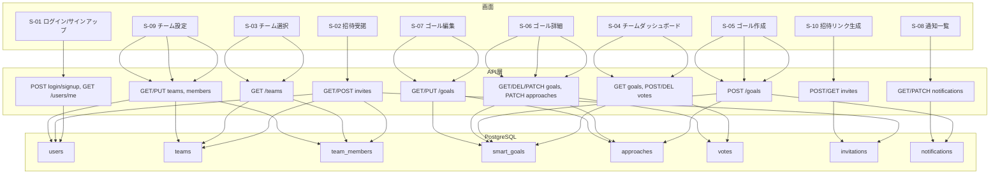
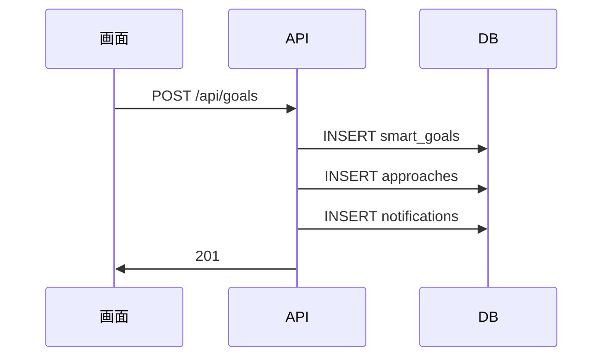
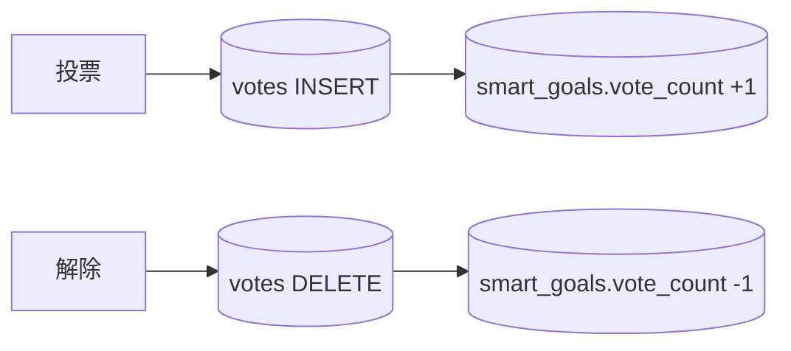
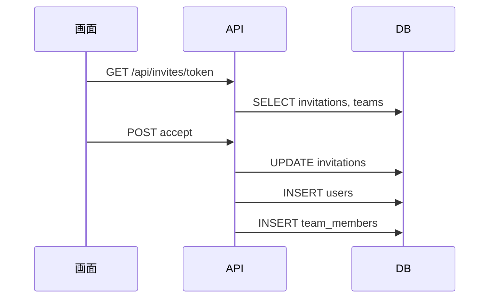

# 04_データフロー図

## 目的

システム内でのデータの流れを可視化する。

---

## 参照

- 基本設計：04_CRUD図
- 詳細設計：05_フロント側処理フロー
- 詳細設計：06_呼び出すAPI
- 02_テーブル定義詳細（物理設計）

---

## 1. 画面からデータベースへのデータフロー（全体像）

以下は、画面ID・主なAPI・対象テーブルの対応をフローで示したもの。テーブル名は 02_テーブル定義詳細（物理設計）に準拠。

---

## 2. 画面・API・テーブル対応一覧

| 画面ID | 画面名 | 主なAPI | 対象テーブル |
|--------|--------|---------|--------------|
| S-01 | ログイン/サインアップ | POST login/signup, GET /users/me | users |
| S-02 | 招待受諾 | GET/POST /api/invites | users(C), teams(R), team_members(C), invitations(RU) |
| S-03 | チーム選択 | GET /api/teams | teams, team_members |
| S-04 | チームダッシュボード | GET goals, POST/DEL votes | smart_goals, votes |
| S-05 | ゴール作成 | POST /api/goals | smart_goals, approaches, notifications |
| S-06 | ゴール詳細 | GET/DEL/PATCH goals, PATCH approaches, POST feedback | smart_goals, approaches, votes |
| S-07 | ゴール編集 | GET/PUT /api/goals | smart_goals, approaches |
| S-08 | 通知一覧 | GET/PATCH /api/notifications | notifications |
| S-09 | チーム設定 | GET/PUT teams, GET/DEL/PATCH members | users, teams, team_members |
| S-10 | 招待リンク生成 | POST/GET /api/teams/teamId/invites | invitations |

---

## 3. API経由のデータフロー（代表例）

### ゴール作成（S-05）

### 投票・投票解除

### 招待受諾（S-02）

---

## 4. データ更新のタイミング

| テーブル | 主な更新タイミング |
|----------|---------------------|
| users | サインアップ(C)、招待経由未登録時の新規登録(C)、ログイン(R)、メンバー一覧(R) |
| teams | 招待表示・一覧・設定(R)、設定更新(U) |
| team_members | 招待受諾(C)、設定で削除・ロール変更(RUD) |
| smart_goals | 作成・編集・ステータス・削除(CRUD) |
| approaches | ゴール作成時一括C、編集CRUD、完了チェックU |
| votes | 投票(C)、解除(D)、表示(R) |
| invitations | リンク生成(C)、受諾時使用済み(U) |
| notifications | サーバー自動作成(C)、既読(U) |

※フィードバック保存先は要確認。

---

## 補足

- テーブル名は 02_テーブル定義詳細 に準拠（invitations, votes）。
- バッチ処理：本システムでは想定なし。
- vote_count と votes はAPI内で同期。

---

## 修正履歴

初期作成後に発見・修正した箇所。

| # | 対象 | 修正内容 | 根拠 |
|---|------|----------|------|
| 1 | flowchart S-02 | `A2-->T1(users)` エッジを追加 | 04_CRUD図: S-02 招待受諾時に未登録ユーザーのアカウント作成（users:C）が発生する |
| 2 | flowchart S-04 | `S04-->A4-->T5(approaches)` エッジを削除 | 06_呼び出すAPI: S-04 ゴール一覧取得APIの対象テーブルは smart_goals のみ |
| 3 | flowchart S-09 | `A9-->T1(users)` エッジを追加 | 06_呼び出すAPI: GET /api/teams/{teamId}/members の対象テーブルは team_members と users |
| 4 | 対応一覧表 S-02 | 対象テーブルに `users(C)` を追加 | 修正 #1 と同様 |
| 5 | 対応一覧表 S-04 | 対象テーブルから `approaches` を削除 | 修正 #2 と同様 |
