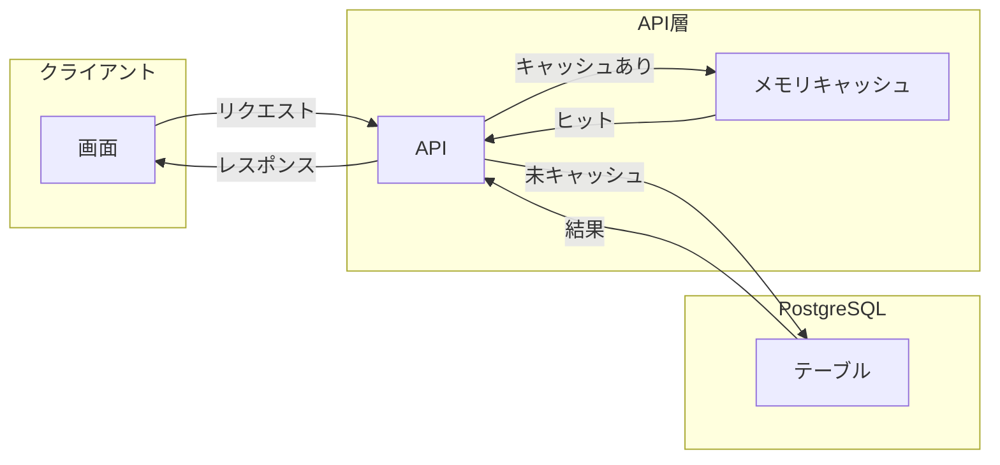

# 05_パフォーマンス設計

## 目的

データベースのパフォーマンス最適化設計を記載する。

---

## 参照

- 02_テーブル定義詳細（物理設計）
- 04_データフロー図
- 06_非機能要件定義書（性能要件）

---

## 1. クエリ最適化方針

非機能要件：画面表示3秒以内、API応答1秒以内、ダッシュボードゴール一覧50件まで遅延なし。

| 方針 | 対象 | ルール・手法 | 補足 |
|------|------|--------------|------|
| インデックス活用 | smart_goals | team_id にインデックスを張る。一覧はチーム単位・50件が前提のため team_id で絞り込みを効率化する | S-04 で GET goals が多用されるため |
| インデックス活用 | smart_goals | 並び替え条件に合わせて必要なら複合インデックスを検討。MVP では team_id のみで開始可 | sort パラメータ対応時 |
| インデックス活用 | approaches | goal_id にインデックス。ゴール詳細取得時に JOIN で使用 | 主キー以外で検索する唯一のパターン |
| インデックス活用 | votes | (goal_id, user_id) は UNIQUE でインデックス付与済み。vote_count は smart_goals.vote_count を利用し都度 COUNT しない | 02_テーブル定義に準拠 |
| インデックス活用 | notifications | user_id にインデックス。通知一覧はユーザー単位の取得が多いため | GET /api/notifications |
| N+1 回避 | 一覧・詳細 | Prisma の include / select で必要なリレーションを一括取得する | 04_データフロー図に合わせる |
| 取得件数制限 | 一覧API | ゴール一覧は50件を上限とする（非機能要件）。ページネーション導入時は LIMIT または cursor を検討 | MVP では50件までで十分 |

---

## 2. キャッシュ戦略

MVP ではアプリ層のキャッシュは最小限とし、DB・Prisma の接続プールとクエリ最適化を優先する。将来キャッシュ層を挟む場合の想定を図示する。

| キャッシュ対象（将来検討） | 想定場所 | 説明 |
|---------------------------|----------|------|
| ゴール一覧（チーム単位） | API層メモリ or Redis | 同一チームの一覧は短時間で同じになりやすい。TTL は短め（例: 60秒） |
| ユーザー情報（/users/me） | セッション | ログイン中は変更が少ない。セッションに載せている場合は追加キャッシュ不要 |
| 招待情報（token 取得） | API層メモリ | 招待リンク表示は1回きり。TTL 短めでよい |

※MVP では「必要になったら導入」とし、まずはインデックスとクエリ最適化で非機能要件を満たすことを優先する。

---

## 3. 読み取り・書き込みの最適化

| 種別 | 方針 | 対象テーブル・API | 手法・補足 |
|------|------|-------------------|------------|
| 読み取り | 一覧は team_id で絞り込み | smart_goals, votes | team_id インデックス。並び順は vote_count / created_at / deadline のいずれかに統一 |
| 読み取り | 詳細は1件取得＋関連を include | smart_goals, approaches | GET /api/goals/{id} で Prisma include により goals + approaches を1往復で取得 |
| 読み取り | 通知は user_id で絞り込み | notifications | user_id インデックス。unread_only の場合は WHERE read = false を併用 |
| 書き込み | ゴール作成は1トランザクションで goals + approaches + notifications | smart_goals, approaches, notifications | Prisma の create + nested create でまとめて commit |
| 書き込み | 投票は votes と smart_goals.vote_count を同一トランザクションで更新 | votes, smart_goals | 整合性のため必ず同一トランザクション |
| 書き込み | 招待受諾は invitations UPDATE と team_members INSERT を同一トランザクション | invitations, team_members | 使用済みフラグ更新とメンバー追加を一括 |

---

## 4. 想定される負荷と対策

| 負荷の種類 | 想定シーン | 対策 | 優先度 |
|------------|------------|------|--------|
| ゴール一覧の表示遅延 | 1チームあたりゴール数が増加（50件超） | ページネーションまたは「最新50件」に制限。インデックスは team_id + created_at 等を検討 | 高 |
| API応答遅延 | 同時アクセス増加 | Prisma の接続プール設定を見直す。DB の max_connections とアプリのプールサイズを整合させる | 中 |
| ゴール作成・編集の遅延 | アプローチ10件＋通知の一括登録 | 1トランザクションで完了させる設計のまま。MVP では通常の create で十分 | 低 |
| 通知一覧の遅延 | 1ユーザーあたり通知件数が増加 | user_id インデックス＋取得件数制限（例: 100件）。古い通知は「もっと見る」で遅延読み込み | 中 |
| 認証のオーバーヘッド | 全APIでトークン検証 | MVP では毎回検証でよい。必要なら認証結果の短期キャッシュを検討 | 低 |

※非機能要件定義書：画面表示3秒以内、API応答1秒以内を目標とする。過度な先行最適化は避ける。

---

## 補足

- テーブル名・カラム名は 02_テーブル定義詳細（物理設計）に準拠している。
- インデックス追加時は 01_データベース詳細設計書 のマイグレーション命名規則に従う（例: add_index_to_goals_team_id）。
- パフォーマンス要件の根拠は 06_非機能要件定義書（性能要件）による。
