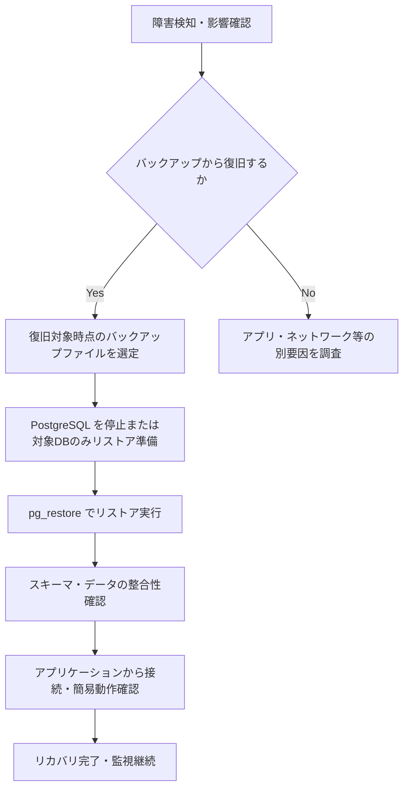
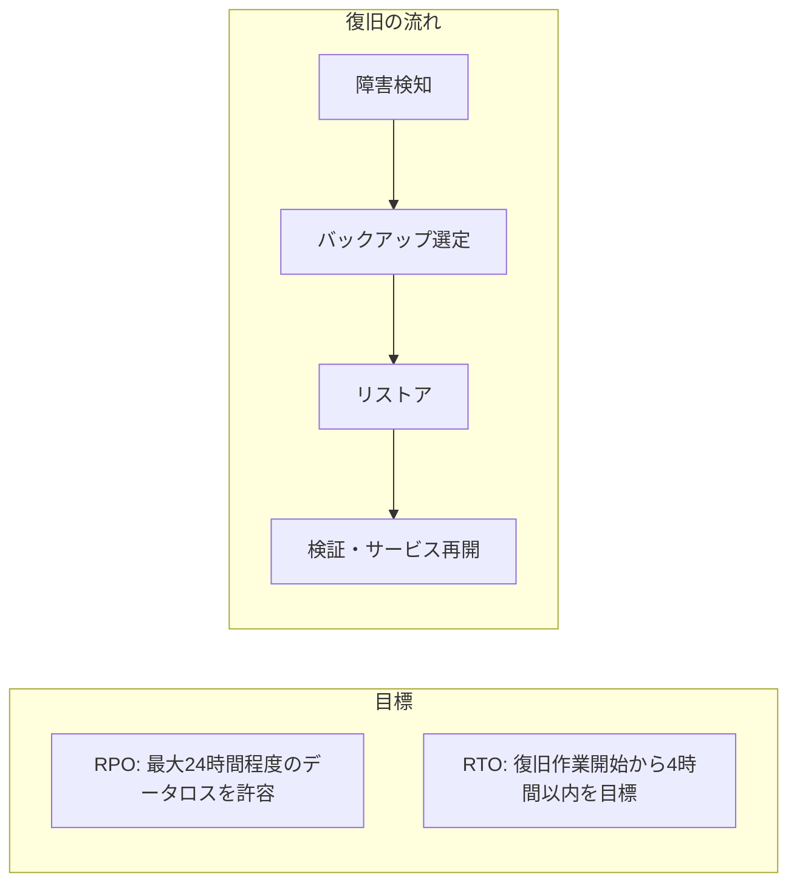
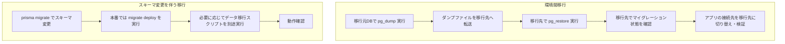

# 06_バックアップ・リカバリ設計

## 目的

データの保全と復旧のための設計を記載する。

---

## 参照

- 02_テーブル定義詳細（物理設計）
- 01_データベース詳細設計書
- 06_非機能要件定義書（保守性・運用要件：バックアップ）

---

## 1. バックアップ方針

非機能要件定義書：データベースの定期バックアップ（日次等）を実施する。01_データベース詳細設計書：日次バックアップ、pg_dump、保持期間30日間（要確認）に準拠する。

| 方針 | 対象 | ツール・手法 | 補足 |
|------|------|--------------|------|
| フルバックアップ | データベース全体（public スキーマ） | PostgreSQL 標準の `pg_dump`（カスタム形式 `-Fc` 推奨） | 02_テーブル定義で定義した全テーブル（users, teams, team_members, smart_goals, approaches, votes, invitations, notifications）を含む |
| 増分バックアップ | MVP では実施しない | - | データ量・運用コストが増えた段階で WAL アーカイブや増分ダンプの検討。現時点では日次フルで十分とする |
| 取得単位 | 1データベース単位 | `pg_dump -d saiteki`（本番は `saiteki_production`） | 01_データベース詳細設計書のデータベース名に準拠 |
| 整合性 | トランザクション一貫性を確保 | `pg_dump` はデフォルトで一貫したスナップショットを取得 | バックアップ実行中の同時書き込みはブロックしない（CONCURRENT 取得） |

---

## 2. バックアップ頻度

| バックアップ種類 | スケジュール | 実行時刻（想定） | 所要時間見込み | 補足 |
|------------------|--------------|------------------|-----------------|------|
| 日次フルバックアップ | 1日1回 | 深夜（例: 3:00 JST）などアクセスが少ない時間帯 | データ量による（MVP では数分以内を想定） | 非機能要件「日次等」を満たす。cron またはマネージドDBの自動バックアップで実行 |
| 本番デプロイ前 | 都度 | 本番反映直前 | 同上 | リリースロールバック用。手動実行またはCIで実行を推奨 |

---

## 3. リカバリ手順

障害検知からリストア・検証までの流れを以下に示す。

| ステップ | 実施内容 | 補足 |
|----------|----------|------|
| 1. 障害検知 | 監視アラート・ユーザー報告・ログ確認で障害を検知し、DB起因かどうかを切り分け | 非機能要件：エラー時は管理者へ通知する仕組みを利用 |
| 2. バックアップ選定 | 復旧したい時点に最も近い、正常なバックアップファイルを選定 | 日次1回のため、最大で約24時間分のデータロスが発生し得る（RPO 後述） |
| 3. リストア | `pg_restore -d 対象DB バックアップファイル` を実行。既存DBを上書きする場合は事前にドロップまたは別DBにリストア | 本番ではメンテナンスウィンドウを確保し、事前にユーザー通知（非機能要件） |
| 4. 検証 | テーブル件数・主要データの存在確認。必要に応じてアプリの疎通確認 | 02_テーブル定義の主要テーブルをサンプル確認 |

---

## 4. データ保持期間

| バックアップ種別 | 保持期間 | 保管場所 | 削除ルール | 補足 |
|------------------|----------|----------|------------|------|
| 日次フル | 30日間（要確認） | サーバーまたはオブジェクトストレージ（S3等） | 保持期間を過ぎたファイルは自動または手動で削除 | 01_データベース詳細設計書の「30日間（要確認）」に合わせる。法・社内規定がある場合は要確認 |
| 本番デプロイ前 | 直近1〜2世代を保持 | 同上またはCI成果物 | 次回デプロイ前後で古いものを削除 | ロールバック用 |

---

## 5. 災害復旧計画（DR）

MVP では同一リージョン・単一DB構成を前提とし、RTO・RPO を目標として明示する。大規模災害時の複数リージョン冗長化は将来検討とする。

| 項目 | 内容 | 補足 |
|------|------|------|
| RPO（目標復旧時点） | 最大約24時間 | 日次1回バックアップのため、最悪で前回バックアップ時点までしか復旧できない。重要度が高くなったら増分やWALアーカイブを検討 |
| RTO（目標復旧時間） | 4時間以内を目標（要確認） | リストア・検証・アプリ確認まで。MVP では目安として記載し、実際の訓練で見直す |
| 災害時の連携 | 管理者への通知（Slack等）・メンテナンス告知 | 非機能要件の「計画停止時は事前にユーザーへ通知」に準拠。障害時も可能な範囲で告知 |

---

## 6. データ移行計画

環境間のデータ移行（開発→ステージング→本番）およびスキーマ変更に伴う移行の想定手順を以下に示す。

| シナリオ | 手順概要 | 補足 |
|----------|----------|------|
| 開発→本番の初回データ投入 | 開発DBで `pg_dump` → ファイルを本番サーバーへ配置 → 本番で `pg_restore`。その前に本番で `prisma migrate deploy` を実行しスキーマを一致させる | 本番DBが空の状態でリストアする想定 |
| スキーマ変更の反映 | 01_データベース詳細設計書に従い、`prisma migrate deploy` でマイグレーションを適用。カラム削除・型変更などデータ変換が必要な場合は、事前にデータ移行用SQLまたはスクリプトを準備 | マイグレーションはトランザクションで実行されるため、失敗時はロールバックされる |
| 本番のリストア先を別DBにする | 新DBを作成 → そのDBに対して `pg_restore` → アプリの DATABASE_URL を新DBに切り替え → 旧DBは保持期間が過ぎたら削除 | ダウンタイムを許容する場合の切り替え手順 |

---

## 補足

- テーブル名・データベース名は 02_テーブル定義詳細（物理設計）および 01_データベース詳細設計書 に準拠している。
- 保持期間「30日間」は 01_データベース詳細設計書の記載に合わせている。社内規定や契約で異なる場合は要確認とし、本ドキュメントを更新すること。
- Mermaid のサブグラフでは `[PostgreSQL]` のように角括弧のみを使用している（シリンダー記法はサブグラフ定義では使用しない）。
