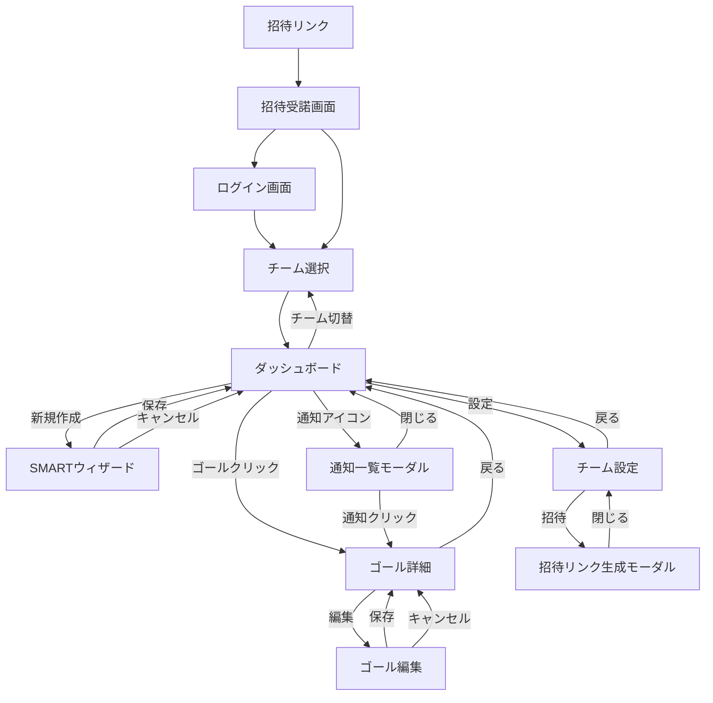

# システム要件定義書

## 1. 開発スコープ
本フェーズでは、以下のMVP機能の開発を行う。

### 対象機能
1.  **チーム作成・管理**
    - リーダーによるチーム作成
    - メンバー招待（招待リンク方式）
    - 権限管理（リーダーとメンバーの役割分離）
2.  **SMARTゴール作成ウィザード**
    - 6ステップ（具体的、測定可能、達成可能、関連性、期限、アプローチ）の入力フォーム
    - ガイドテキストによる入力支援
    - バリデーション機能
3.  **ゴール一覧表示**
    - チームごとのゴールリスト表示
    - 進捗ステータス（未着手 / 進行中 / 完了）の可視化
    - 投票数による優先度表示
4.  **投票機能**
    - ゴールの優先順位付け投票
    - 投票結果の可視化
5.  **通知機能**
    - 重要イベントのアプリ内通知
    - 期限リマインダー
6. **完了機能**
    - ゴールの達成/完了ステータス更新

## 2. 機能要件詳細

### 2.1 チーム・ユーザー管理
- ユーザー登録・ログイン
- チーム作成（リーダー権限）
- メンバー招待・管理
- 複数チームの表示・切り替え

#### メンバー招待の詳細仕様
**招待方法**: 招待リンクを生成し、メールまたはチャットで共有

**招待リンクの仕様**:
- ユニークなトークンを含むURL形式
- 有効期限: 7日間
- 1回のみ使用可能
- リーダーのみ生成可能

**招待フロー**:
1. リーダーがチーム設定画面から招待リンクを生成
2. 生成されたリンクをコピーしてメンバーに共有
3. メンバーがリンクをクリック
4. 未ログイン状態の場合はサインアップ画面へ遷移
5. アカウント作成後、自動的にチームに参加
6. 既にログイン済みの場合は確認ダイアログ表示後、チームに参加

### 2.2 SMARTゴール策定ウィザード
課題解決のためのゴールを設定する際、ウィザード形式で以下の要素を明確にする。

1.  **具体的**: 何を達成するか？
2.  **測定可能**: 達成基準は数値でどう表せるか？
3.  **達成可能**: 現実的なリソースで達成可能か？
4.  **関連性**: チームの目的やビジネス目標とリンクしているか？
5.  **期限**: いつまでに達成するか？
6.  **アプローチ**: 達成に向けた具体的な手順

### 2.3 ゴール一覧と進捗管理
-   **ゴール一覧**: 設定されたSMARTゴールをリスト表示
-   **ステータス変更**: 未着手 / 進行中 / 完了 の状態管理
-   **アプローチ進捗**: 現在取り組んでいる手順の可視化
-   **完了アクション**: ゴール達成時の完了操作

### 2.4 投票機能
ゴールの優先順位をチーム全体で決定するための投票機能。

**投票対象**: 未着手状態のゴール

**投票方法**:
- 各メンバーが1ゴールにつき1票を投票
- 投票の取り消しと変更が可能
- 自分が作成したゴールにも投票可能

**投票結果**:
- ダッシュボードで投票数順にソート表示
- 投票結果はゴールの優先度スコアとして保存
- 投票数はゴールカードにバッジ表示

### 2.5 通知機能
重要なイベント発生時にメンバーへ通知する機能。

**通知対象イベント**:
1. **新ゴール作成時**: チーム全員に通知
2. **ステータス変更時**: ゴール所有者とリーダーに通知
3. **期限リマインダー**:
   - 7日前: ゴール所有者に通知
   - 3日前: ゴール所有者とリーダーに通知
   - 当日: ゴール所有者とリーダーに通知
4. **ゴール完了時**: チーム全員に通知

**通知方法**:
- MVP版: アプリ内通知のみ
- 将来構想: メール通知、Slack連携

**通知UI**:
- ヘッダーに通知アイコン表示
- 未読件数のバッジ表示
- クリックで通知一覧モーダルを表示
- 各通知に既読/未読の状態を持つ
- 通知をクリックすると関連する画面へ遷移

### 2.6 権限管理
チームリーダーとメンバーの権限を明確に定義。

| 操作 | リーダー | メンバー |
|:---|:---:|:---:|
| チーム作成 | ⭕️ | ❌ |
| メンバー招待 | ⭕️ | ❌ |
| メンバー削除 | ⭕️ | ❌ |
| ゴール作成 | ⭕️ | ⭕️ |
| ゴール編集（自分が作成） | ⭕️ | ⭕️ |
| ゴール編集（他人が作成） | ⭕️ | ❌ |
| ゴール削除（自分が作成） | ⭕️ | ⭕️ |
| ゴール削除（他人が作成） | ⭕️ | ❌ |
| ステータス変更 | ⭕️ | ⭕️ |
| 投票 | ⭕️ | ⭕️ |
| チーム設定変更 | ⭕️ | ❌ |

**実装方針**:
- ユーザーテーブルにroleフィールド（leader / member）を追加
- 各API呼び出し時に権限チェックを実施
- 権限がない操作のUIは非表示または非活性化

## 3. 画面構成・遷移

### 3.1 画面一覧
1.  **ログイン / サインアップ**
    - メール/パスワード入力、またはGoogleログインボタン
2.  **招待受諾画面**
    - 招待リンクからアクセスした場合に表示
    - チーム名と招待者の情報を表示
    - 参加ボタンでチームに加入
3.  **チーム選択**
    - リーダーは自身の管理する2チームから選択
    - メンバー所属チームが1つの場合はスキップ
4.  **チームダッシュボード**
    - **ヘッダー**: チーム名、通知アイコン、ユーザーアイコン、チーム切替
    - **サマリー**: 現在の進行中ゴール数、達成率
    - **ゴールリスト**: SMARTゴール一覧（カード形式）
        - ステータス（未着手 / 進行中 / 完了）を色分け
        - 投票数バッジ表示
        - 「進行中」のゴールを強調表示
        - 現在のアプローチ進捗を表示
    - **FAB**: 新規SMARTゴール作成ボタン
5.  **SMARTゴール作成ウィザード**
    - 1画面1項目のステップ入力形式
    - 各ステップでSMART+アプローチの要素を入力
    - リアルタイムバリデーション
    - **確認**: 入力内容確認・保存
6.  **ゴール詳細**
    - ゴールの詳細表示
    - **投票セクション**: 投票ボタンと投票数表示
    - **アプローチリスト**: 手順のチェックリスト
        - 各手順の完了/未完了を切り替え可能
        - 進捗状況をパーセンテージで表示
        - 現在取り組み中の手順がわかるハイライト表示
    - ステータス変更アクション
    - 編集/削除ボタン（権限がある場合のみ表示）
    - 完了時フィードバック入力
7.  **ゴール編集画面**
    - ゴール作成ウィザードと同様のUI
    - 既存データを初期値として表示
8.  **通知一覧モーダル**
    - 通知の一覧表示
    - 未読/既読の切り替え
    - 各通知をクリックで関連画面へ遷移
9.  **チーム設定画面（リーダーのみ）**
    - チーム情報の編集
    - メンバー一覧と削除機能
    - 招待リンク生成ボタン
10. **招待リンク生成モーダル（リーダーのみ）**
    - 招待リンクの表示
    - コピーボタン
    - 有効期限の表示

### 3.2 画面遷移図

## 4. データ項目・制約条件

### 4.1 チーム
- **チーム名**: 必須, 最大50文字
- **説明**: 任意, 最大200文字

### 4.2 SMARTゴール

| 項目 | 必須 | 型 | 制約・バリデーション | 補足 |
| :--- | :---: | :--- | :--- | :--- |
| **タイトル** | 必須 | 文字列 | 最大100文字 | 一覧表示用 |
| **具体的** | 必須 | テキスト | 最少10文字, 最大500文字 | 具体性を担保するため短すぎないこと |
| **測定可能** | 必須 | テキスト | 最大200文字 | 数値目標を含めることを推奨 |
| **達成可能** | 必須 | 真偽値 | チェックボックス | 「現実的である」ことの確認 |
| **関連性** | 必須 | テキスト | 最大200文字 | チーム目標との関連 |
| **期限** | 必須 | 日付 | 未来の日付 | 過去日は選択不可 |
| **アプローチ** | 必須 | リスト | 最大10項目 | 達成に向けた手順のリスト。各項目に完了フラグを持ち、進捗状況を可視化する |
| **所有者** | 必須 | ユーザーID | チームメンバーから選択 | デフォルトは作成者 |
| **ステータス** | 必須 | 列挙型 | `TODO`, `IN_PROGRESS`, `DONE` | 初期値: `TODO` |
| **投票数** | - | 数値 | 0以上 | 投票を受けた数 |

### 4.3 投票

| 項目 | 必須 | 型 | 制約・バリデーション | 補足 |
| :--- | :---: | :--- | :--- | :--- |
| **ゴールID** | 必須 | UUID | 存在するゴールID | 投票対象のゴール |
| **ユーザーID** | 必須 | UUID | 存在するユーザーID | 投票者 |
| **投票日時** | 必須 | タイムスタンプ | - | 投票した日時 |

**制約**:
- 1ユーザーは1ゴールに1票まで
- ユニーク制約: ゴールID + ユーザーID

### 4.4 招待

| 項目 | 必須 | 型 | 制約・バリデーション | 補足 |
| :--- | :---: | :--- | :--- | :--- |
| **トークン** | 必須 | 文字列 | UUID形式 | ユニークな招待トークン |
| **チームID** | 必須 | UUID | 存在するチームID | 招待先のチーム |
| **招待者ID** | 必須 | UUID | 存在するユーザーID | 招待を発行したリーダー |
| **有効期限** | 必須 | タイムスタンプ | 未来の日付 | デフォルト: 作成日時+7日 |
| **使用済みフラグ** | 必須 | 真偽値 | - | 初期値: false |
| **使用日時** | 任意 | タイムスタンプ | - | 招待が使用された日時 |

### 4.5 通知

| 項目 | 必須 | 型 | 制約・バリデーション | 補足 |
| :--- | :---: | :--- | :--- | :--- |
| **ユーザーID** | 必須 | UUID | 存在するユーザーID | 通知の受信者 |
| **種別** | 必須 | 列挙型 | GOAL_CREATED, STATUS_CHANGED, DEADLINE_REMINDER, GOAL_COMPLETED | 通知の種類 |
| **メッセージ** | 必須 | 文字列 | 最大500文字 | 通知内容 |
| **関連ゴールID** | 任意 | UUID | 存在するゴールID | 関連するゴール |
| **既読フラグ** | 必須 | 真偽値 | - | 初期値: false |
| **作成日時** | 必須 | タイムスタンプ | - | 通知が作成された日時 |

## 5. 技術スタック（推奨）
- **Frontend**: React (Next.js) + TypeScript
- **Backend**: Next.js API Routes (TypeScript) または Node.js + Express/NestJS (TypeScript)
- **Database**: PostgreSQL (Prisma ORM推奨)
- **Auth**: NextAuth.js (Auth.js)

## 6. UI/UXデザイン指針
- **直感的かつモダン**: エンジニアが使いたくなる、シンプルでダークモード対応のモダンなUI
- **入力負荷の軽減**: ウィザード形式による段階的な入力
- **可視化**: ステータスや進捗の直感的な表示

## 7. バリデーション要件

### 7.1 入力検証の基本方針
- **クライアントサイド**: リアルタイムバリデーション（フォーカスアウト時）
- **サーバーサイド**: すべての入力を再検証

### 7.2 エラー表示方法
- **表示位置**: 入力フィールドの直下に赤字で表示
- **フィールドハイライト**: エラーのあるフィールドを赤枠で囲む
- **リアルタイム**: フォーカスアウト時に即座にエラー表示
- **エラー解消**: 正しい値を入力すると即座にエラー表示が消える

### 7.3 ウィザードでのバリデーション挙動
- **次へボタン**: バリデーションエラーがある場合は非活性化
- **戻るボタン**: 入力内容を保持したまま前のステップへ遷移
- **キャンセルボタン**: 確認ダイアログを表示後、入力内容を破棄

### 7.4 エラーメッセージ例

| エラー条件 | エラーメッセージ |
|:---|:---|
| タイトル未入力 | タイトルを入力してください |
| タイトル文字数超過 | 100文字以内で入力してください（現在120文字） |
| 具体的な内容が短すぎる | 具体的な内容を10文字以上入力してください |
| 具体的な内容が長すぎる | 500文字以内で入力してください（現在520文字） |
| 期限が過去 | 未来の日付を選択してください |
| 達成可能チェックなし | 達成可能性を確認してください |
| アプローチが空 | 少なくとも1つの手順を追加してください |

### 7.5 サーバーエラー時の挙動
- **エラートースト通知**: 画面上部にエラーメッセージを表示（5秒間）
- **入力内容の保持**: エラー発生時も入力内容は保持
- **リトライボタン**: エラーダイアログにリトライボタンを表示
- **ログ記録**: サーバーエラーは詳細をログに記録

## 8. 非機能要件

### 8.1 性能
- 画面表示は3秒以内に完了すること
- API応答時間は1秒以内を目標とする
- ダッシュボードのゴール一覧は50件まで一度に表示

### 8.2 可用性
- 稼働率99%以上を目標とする
- 計画停止時は事前にユーザーへ通知する

### 8.3 セキュリティ
- パスワードはハッシュ化して保存
- 通信はHTTPSを必須とする
- 認証トークンには有効期限を設定する
- チームデータは所属メンバーのみアクセス可能とする
- 招待トークンは推測不可能なランダム文字列を使用
- APIエンドポイントで権限チェックを実施

### 8.4 保守性
- アプリケーションログを出力する
- エラー発生時は管理者へ通知する仕組みを設ける
- データベースの定期バックアップを実施
